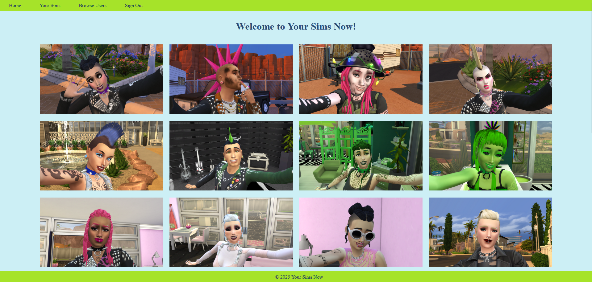
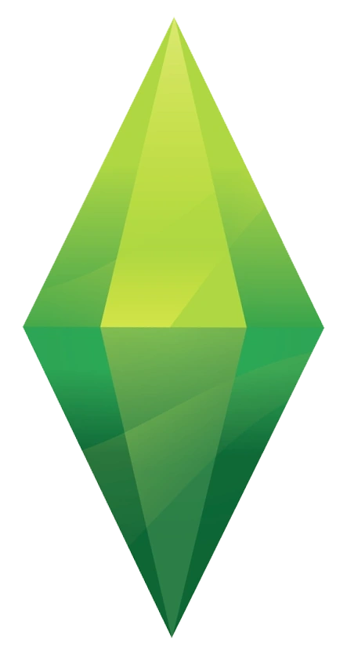

# Welcome to Your Sims!

I created a website called **Your Sims** (since "My Sims" is already the name of a game by Electronic Arts). The idea for this website came from a personal need, and I thought other players might find it useful as well. The purpose of this site is to help The Sims 4 players keep track of the sims they’ve created in the game.

In The Sims 4, navigating through the game to find information about a specific sim can be time-consuming. When you need to check details about multiple sims, it can become even more tedious due to loading screens and having to load into different worlds and lots. I created this website as a solution to that problem, allowing players to quickly access key details about their sims, whether it's to check if a sim is single or to review their traits for easier matchmaking.

As someone who creates a vast amount of sims, this tool has made the matchmaking process much quicker for me. Additionally, since I often make similar sims, using the website to upload my creations has helped me realize which features of the game I haven’t explored yet, whether it’s career tracks, aspirations, or other aspects of the game.

I believe this website could be especially valuable for players who engage in legacy challenges, where they maintain a family tree over many generations. It could serve as a way to look up details about sims who have passed away, something that’s typically not possible after their spirits have moved on.

Your Sims also offers a platform for players to share their sims with others and explore creations from the community. In the future, I plan to allow users to link their EA ID to their profile so that others can easily find and download their sims from the in-game Gallery.

## Resources Used

### Coding Resources
[HTML Form Elements](https://www.w3schools.com/html/html_form_elements.asp)

[WebAIM's Contrast Checker](https://webaim.org/resources/contrastchecker/)

[CSS Buttons](https://www.w3schools.com/css/css3_buttons.asp)

### The Sims 4 Resources

[All Careers in The Sims 4](https://www.dexerto.com/sims/all-careers-in-the-sims-4-2841750/)

[Worlds in The Sims 4 ](https://sims.fandom.com/wiki/Category:Worlds_in_The_Sims_4)

[The Sims 4 Occults](https://sims.fandom.com/wiki/Life_state#The_Sims_4)

[The Sims 4 Aspirations](https://sims.fandom.com/wiki/Aspiration_(The_Sims_4))

### Assets Used

[Plumbob Photo](https://sims.fandom.com/wiki/Plumbob)

### Technologies Used

HTML, CSS, JavaScript, EJS, Express, Morgan, DotENV, Mongoose, MongoDB

### Stretch Goals

These are the things that I want to add to my website in the future: 

* Make it display the sims on a user's list of sims in alphabetical order instead of in the order of creation
* Make it so that a sim's partner, instead of just being listed, is linked and the user is able to click on it to go to that sims profile page
* Display photos of all users' sims on the front page of the website which would link to the sims profile page
* Make it so that users can add their EA ID onto their profile
* Make it so that users can upload their photos directly to the website instead of having to host them outside of the website
* Make it so that users can add their sim's pets in the same way they can add and browse sims

### Accessible Color Palette

I wanted to give this website a Sims 4 themed color palette, blue like the text of "The Sims" and bright green like the famous plumbob. I made the color palette accessible for people with visual disabilities by using [WebAIM's Contrast Checker](https://webaim.org/resources/contrastchecker/).

* Light Blue Background Color #CCEFF5

* Dark Blue Text #2A4B74

* Navigation Bar Green #a6e329

* Navigation Text #223E5E

* Dark Green #0E5D34

* Secondary Navigation Text #E0F6FA

* Light Green Text #E6F9C8

# Dag dag!
